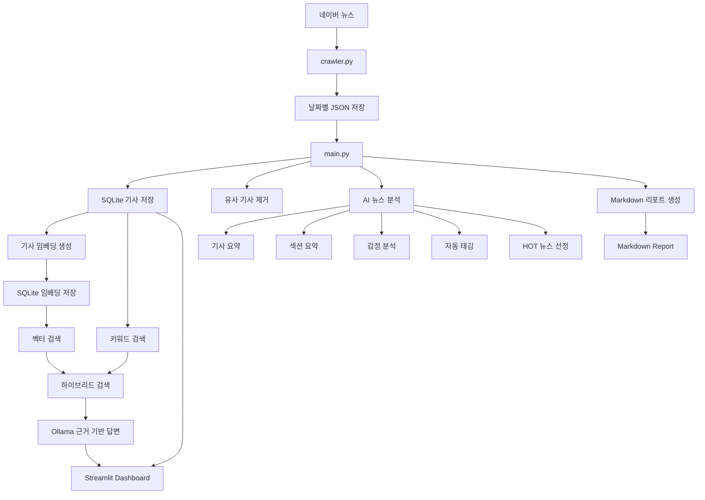
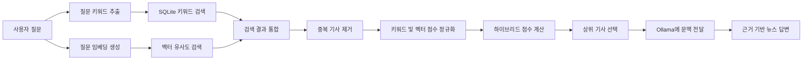

# 📰 AI News Report System

네이버 뉴스를 자동으로 수집하고, 로컬 LLM과 하이브리드 검색을 활용해 기사 요약, 뉴스 분석, 검색 및 질의응답 기능을 제공하는 AI 뉴스 분석 시스템입니다.

수집한 뉴스는 JSON과 SQLite에 저장하며, Streamlit 대시보드에서 통계, 조건 검색, 기사 조회 및 AI 뉴스 비서 기능을 사용할 수 있습니다.

---

## 📌 프로젝트 목표

매일 주요 뉴스를 자동으로 수집하고 다음 과정을 하나의 파이프라인으로 처리하는 것을 목표로 합니다.

```text
뉴스 수집
→ 원본 데이터 저장
→ AI 분석
→ 메타데이터 저장
→ 통계 및 조건 검색
→ 벡터 검색
→ 하이브리드 RAG
→ Streamlit 시각화
```

단순한 뉴스 크롤러가 아니라 데이터 수집부터 AI 분석, 검색, 질의응답, 시각화까지 연결된 뉴스 분석 서비스를 구현하는 프로젝트입니다.

---

## ✨ 주요 기능

### 뉴스 수집

* 네이버 뉴스 섹션별 헤드라인 수집
* 기사 제목, 언론사, 링크, 본문 수집
* 정치, 경제, 사회, 생활/문화, IT/과학, 세계 섹션 지원
* 날짜별 JSON 원본 데이터 저장

### 데이터 저장

* JSON 기반 원본 뉴스 보관
* SQLite 기반 누적 기사 저장
* 기사 링크 기준 중복 저장 방지
* 기사 감정 및 태그 메타데이터 저장
* 기사 임베딩 벡터 저장

### AI 분석

* Ollama 기반 로컬 LLM 실행
* 기사별 핵심 내용 요약
* 섹션별 뉴스 흐름 요약
* 긍정·중립·부정 감정 분석
* 규칙 기반 뉴스 자동 태깅
* 기사 중요도 기반 HOT 뉴스 선정

### 키워드 및 트렌드 분석

* 기사 제목과 본문 기반 키워드 추출
* 최근 반복 키워드 분석
* 당일과 과거 데이터를 비교한 급상승 키워드 탐지
* 유사 제목 기반 중복 기사 제거

### 뉴스 검색

다음 조건을 조합하여 SQLite에 저장된 기사를 검색할 수 있습니다.

* 키워드
* 뉴스 섹션
* 언론사
* 날짜 범위
* 태그
* 감정 유형

### 벡터 검색

* Sentence Transformers 기반 다국어 기사 임베딩 생성
* 질문과 기사 벡터 간 코사인 유사도 계산
* 정확한 단어가 일치하지 않아도 의미가 비슷한 기사 검색
* 생성된 임베딩을 SQLite BLOB 형태로 저장

### 하이브리드 RAG 뉴스 비서

* 사용자 질문에서 핵심 키워드 추출
* SQLite `LIKE` 기반 키워드 검색
* 임베딩 기반 벡터 검색
* 두 검색 결과 통합 및 중복 제거
* 키워드 점수와 벡터 유사도 기반 재정렬
* 상위 기사만 로컬 LLM에 전달
* 검색된 기사 내용을 근거로 답변 생성
* 참고 기사와 검색 점수 표시

### Streamlit 대시보드

* 오늘 수집 기사 및 섹션 수 표시
* 언론사별 기사 수 통계
* 섹션별 기사 수 통계
* 날짜별 수집량 추이
* 감정 분석 건수 및 비율
* 주요 뉴스 태그 TOP 10
* 조건별 뉴스 검색
* 오늘 뉴스 조회
* AI 뉴스 비서 질의응답
* 하이브리드 검색 점수 및 검색 방식 확인

---

## 🏗️ 시스템 구조



---

## 🔍 하이브리드 RAG 동작 방식



하이브리드 점수는 키워드 검색 점수와 벡터 유사도를 결합하여 계산합니다.

기본 가중치는 다음과 같습니다.

```text
키워드 점수: 45%
벡터 유사도: 55%
```

두 검색 방식에서 동시에 발견된 기사에는 추가 점수를 부여합니다.

---

## 🛠 기술 스택

### Language

* Python 3.12

### Crawling

* Requests
* BeautifulSoup4

### Database

* SQLite
* JSON

### AI / NLP

* Ollama
* Qwen2.5:3B
* Sentence Transformers
* paraphrase-multilingual-MiniLM-L12-v2
* NumPy
* 코사인 유사도

### Dashboard

* Streamlit
* Pandas

### Version Control

* Git
* GitHub

---

## 📂 프로젝트 구조

```text
news/
│
├── main.py
├── crawler.py
├── report_generator.py
├── dashboard.py
├── config.py
│
├── build_embeddings.py
├── test_vector_search.py
│
├── services/
│   ├── __init__.py
│   ├── db_service.py
│   ├── hot_news_service.py
│   ├── keyword_service.py
│   ├── llm_service.py
│   ├── rag_service.py
│   ├── sentiment_service.py
│   ├── similarity_service.py
│   ├── tag_service.py
│   ├── trend_service.py
│   └── vector_service.py
│
├── utils/
│   ├── __init__.py
│   └── file_utils.py
│
├── data/
│   ├── news.db
│   └── raw/
│       └── naver_news_YYYYMMDD.json
│
├── reports/
│   └── daily_news_report_YYYYMMDD.md
│
├── .streamlit/
│   └── config.toml
│
├── requirements.txt
├── .gitignore
└── README.md
```

---

## 📁 주요 파일 역할

| 파일                      | 역할                                   |
| ----------------------- | ------------------------------------ |
| `main.py`               | 뉴스 수집부터 저장, 분석, 리포트 생성까지 전체 실행 흐름 관리 |
| `crawler.py`            | 네이버 뉴스 헤드라인과 기사 본문 수집                |
| `report_generator.py`   | Markdown 뉴스 분석 리포트 생성                |
| `dashboard.py`          | Streamlit 기반 뉴스 조회·검색·통계·AI 비서 화면    |
| `config.py`             | 모델명, DB 경로, 저장 경로, 태그 규칙 등 공통 설정     |
| `db_service.py`         | SQLite 테이블 생성, 기사 저장, 검색 및 통계        |
| `llm_service.py`        | Ollama 호출, 기사 요약, 섹션 요약              |
| `sentiment_service.py`  | 기사 감정 분석 및 섹션별 감정 집계                 |
| `tag_service.py`        | 규칙 기반 기사 태그 생성                       |
| `keyword_service.py`    | 기사 키워드 추출 및 빈도 계산                    |
| `trend_service.py`      | 반복 키워드 및 급상승 키워드 분석                  |
| `hot_news_service.py`   | 기사 중요도 점수 및 HOT 뉴스 선정                |
| `similarity_service.py` | 제목 유사도 기반 중복 기사 제거                   |
| `vector_service.py`     | 기사 임베딩 생성·저장 및 벡터 검색                 |
| `rag_service.py`        | 키워드 검색과 벡터 검색을 결합한 뉴스 질의응답           |
| `build_embeddings.py`   | 임베딩이 없는 기사들의 벡터 일괄 생성                |
| `test_vector_search.py` | 터미널에서 벡터 검색 결과 테스트                   |

---

## ▶️ 실행 방법

### 1. 저장소 복제

```bash
git clone <REPOSITORY_URL>
cd news
```

### 2. 가상환경 생성

Windows 기준:

```bash
python -m venv .venv
.venv\Scripts\activate
```

### 3. 패키지 설치

```bash
pip install -r requirements.txt
```

필요한 주요 패키지:

```bash
pip install requests beautifulsoup4 pandas streamlit numpy sentence-transformers
```

### 4. Ollama 실행

```bash
ollama serve
```

Ollama가 이미 백그라운드에서 실행 중이라면 별도로 실행하지 않아도 됩니다.

### 5. 로컬 모델 다운로드

```bash
ollama pull qwen2.5:3b
```

### 6. 뉴스 수집 및 리포트 생성

```bash
python main.py
```

실행 흐름:

```text
뉴스 크롤링
→ JSON 저장
→ SQLite 저장
→ 감정 및 태그 생성
→ 유사 기사 제거
→ 뉴스 분석
→ Markdown 리포트 생성
```

### 7. 기사 임베딩 생성

```bash
python build_embeddings.py
```

새로 추가된 기사 중 아직 임베딩이 없는 기사만 처리합니다.

### 8. 벡터 검색 테스트

```bash
python test_vector_search.py
```

테스트 질문 예시:

```text
인공지능 산업 투자와 관련된 소식
원화 가치와 환율 변동에 관한 경제 기사
기업의 개인정보 유출과 보안 사고
```

### 9. Streamlit 대시보드 실행

```bash
streamlit run dashboard.py
```

---

## 📊 생성 결과

### JSON 원본 데이터

```text
data/raw/naver_news_YYYYMMDD.json
```

### SQLite 데이터베이스

```text
data/news.db
```

주요 테이블:

```text
news_articles
article_embeddings
```

### Markdown 리포트

```text
reports/daily_news_report_YYYYMMDD.md
```

리포트에는 다음 내용이 포함됩니다.

* 최근 반복 키워드
* 급상승 키워드
* HOT 뉴스 TOP 5
* 섹션별 핵심 키워드
* 섹션별 흐름 요약
* 섹션별 감정 분석
* 기사별 태그
* 기사별 AI 요약

---

## ⚙️ Streamlit 파일 감시 설정

Transformers 내부 모듈을 Streamlit이 검사하면서 `torchvision` 관련 로그가 반복 출력되는 경우 다음 설정을 사용할 수 있습니다.

`.streamlit/config.toml`

```toml
[server]
fileWatcherType = "none"
```

이 설정을 적용하면 Streamlit의 자동 파일 감시 기능이 비활성화됩니다.

---

## ⚠️ 현재 한계

* 네이버 뉴스 HTML 구조가 변경되면 크롤링 선택자 수정이 필요합니다.
* 감정 분석과 태깅 결과는 모델 및 규칙에 따라 부정확할 수 있습니다.
* 초기 데이터에는 감정 및 태그 값이 비어 있을 수 있습니다.
* SQLite에 저장된 모든 임베딩을 메모리로 불러와 비교하므로 데이터가 매우 많아지면 성능이 저하될 수 있습니다.
* 현재 하이브리드 점수 가중치는 수동으로 설정한 값이며 별도 평가 데이터로 최적화하지 않았습니다.
* 로컬 LLM 성능과 응답 속도는 PC 사양과 모델 크기에 영향을 받습니다.
* 현재 사용자 계정, 즐겨찾기, 개인 관심사 저장 기능은 제공하지 않습니다.

---

## 🔮 향후 개선 계획

### 검색 품질

* Cross Encoder 기반 Reranker 적용
* BM25 검색 도입
* 하이브리드 검색 가중치 실험 및 평가
* 검색 정확도 평가용 테스트 데이터 구축

### 데이터 처리

* 기존 기사 감정 및 태그 백필
* 기사 수정 시 임베딩 자동 갱신
* SQLite에서 PostgreSQL로 확장
* 데이터 수집 실패 재시도 및 로그 관리

### AI 기능

* 답변 문장별 출처 표시
* 기사 간 관점 비교
* 날짜 조건을 반영한 자연어 질의
* 사용자 관심 키워드 기반 뉴스 추천

### 서비스

* 즐겨찾기 및 읽음 상태
* 관심 태그 설정
* 이메일 또는 메신저 아침 뉴스 알림
* 외부 배포
* 자동 실행 스케줄링

---

## 🧩 문제 해결 경험

### 유사 기사 중복 문제

제목 유사도 비교를 통해 같은 사건을 다룬 유사 기사가 반복 노출되는 문제를 줄였습니다.

### 급상승 키워드 정확도 문제

최근 데이터에 당일 기사가 포함되어 상승 점수가 낮아지는 문제를 확인하고, 과거 비교 데이터에서 당일 파일을 제외하도록 수정했습니다.

### 코드 유지보수 문제

초기에는 분석 코드가 하나의 파일에 집중되어 기능 위치를 찾기 어려웠습니다. 이후 기능을 `services`, 파일 입출력을 `utils`, 설정을 `config.py`로 분리했습니다.

### 기존 DB의 NULL 데이터 문제

과거 기사 중 `tags`, `sentiment`가 `NULL`인 데이터에서 문자열 메서드를 호출하며 오류가 발생했습니다. `(value or "")` 방식으로 NULL 값을 안전하게 처리했습니다.

### Streamlit과 Transformers 충돌 로그

Streamlit 파일 감시기가 Transformers의 이미지 관련 모듈을 검사하면서 `torchvision` 미설치 로그를 반복 출력하는 문제를 확인했습니다. 파일 감시 비활성화 설정으로 불필요한 로그를 줄였습니다.

### 정확한 문자열 검색의 한계

SQLite `LIKE` 검색만으로는 표현이 다른 유사 의미의 기사를 찾기 어려웠습니다. 다국어 문장 임베딩과 코사인 유사도를 도입하고, 키워드 검색과 벡터 검색을 결합한 하이브리드 검색으로 개선했습니다.

---

## 📚 프로젝트를 통해 배운 점

* 비정형 뉴스 데이터 수집 및 전처리
* 로컬 LLM을 활용한 텍스트 요약과 분류
* SQLite 기반 데이터 저장·검색·집계
* 문장 임베딩과 코사인 유사도
* 키워드 검색과 벡터 검색의 차이
* 하이브리드 검색 구조와 RAG 파이프라인
* Streamlit 기반 데이터 서비스 구현
* 기능별 모듈화와 리팩토링
* Git 및 GitHub 기반 기능 단위 버전 관리
* 수집부터 분석, 검색, 시각화까지 End-to-End 파이프라인 설계

---

## 🎯 개발 목적

이 프로젝트는 다음 과정을 직접 경험하기 위해 개발했습니다.

```text
외부 데이터 수집
→ 원본 데이터 저장
→ 데이터 정제
→ AI 분석
→ 메타데이터 생성
→ 조건 검색
→ 의미 기반 검색
→ RAG 답변 생성
→ 대시보드 시각화
```

로컬 LLM을 활용하여 외부 유료 AI API 의존도를 낮추고, 뉴스 데이터가 쌓일수록 검색과 분석 가치가 증가하는 구조를 구현하는 것이 목표입니다.
