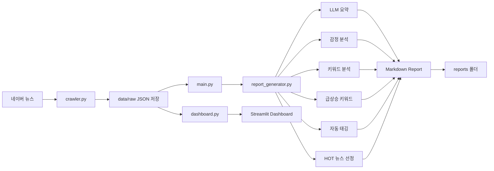

# 📰 AI News Report System

네이버 뉴스를 자동으로 수집하고, 로컬 LLM(Ollama)을 활용하여 요약 및 분석 리포트를 생성하는 프로젝트입니다.

---

# 📌 프로젝트 목표

매일 아침 주요 뉴스를 자동으로 수집하고 분석하여 다음 정보를 제공하는 것을 목표로 합니다.

* 뉴스 기사 수집
* 기사 본문 수집
* AI 기반 기사 요약
* 섹션별 핵심 흐름 분석
* 키워드 추출
* 최근 반복 키워드 분석
* 급상승 키워드 탐지
* 뉴스 감정(분위기) 분석
* 뉴스 자동 태깅
* HOT 뉴스 선정
* Streamlit 대시보드 제공

---

# 🏗️ 시스템 아키텍처



---

# 🛠 기술 스택

## Backend

* Python
* Requests
* BeautifulSoup4

## AI

* Ollama
* Qwen2.5:3B

## Visualization

* Streamlit
* Pandas

## Version Control

* Git
* GitHub

---

# 📂 프로젝트 구조

```text
news/
│
├── main.py
├── crawler.py
├── report_generator.py
├── dashboard.py
├── config.py
│
├── services/
│   ├── llm_service.py
│   ├── keyword_service.py
│   ├── sentiment_service.py
│   ├── tag_service.py
│   ├── trend_service.py
│   ├── hot_news_service.py
│   └── similarity_service.py
│
├── utils/
│   ├── file_utils.py
│
├── data/
│   └── raw/
│
└── reports/
```

---

# 🚀 주요 기능

## 1. 뉴스 크롤링

수집 대상:

* 정치
* 경제
* 사회
* 생활/문화
* IT/과학
* 세계

네이버 뉴스 헤드라인 및 기사 본문을 자동 수집합니다.

---

## 2. AI 기사 요약

Ollama + Qwen2.5 모델을 활용하여 기사 본문을 요약합니다.

제공 정보:

* 핵심 사건
* 원인 및 배경
* 영향 및 의미

---

## 3. 섹션별 뉴스 흐름 분석

정치, 경제, 사회 등 각 섹션의 기사들을 종합하여 전체 흐름을 분석합니다.

예시:

* 금리 인하 기대감 증가
* 반도체 투자 확대
* 글로벌 무역 갈등 심화

---

## 4. 키워드 분석

기사 제목 및 본문을 기반으로 주요 키워드를 추출합니다.

예시:

* 반도체
* 환율
* 미국
* 중국
* AI

---

## 5. 최근 반복 키워드 분석

최근 N일 동안 반복적으로 등장하는 키워드를 분석합니다.

예시:

* 반도체
* 금리
* 환율

---

## 6. 급상승 키워드 탐지

오늘 기사와 과거 기사 데이터를 비교하여 급증한 키워드를 탐지합니다.

예시:

* 관세
* 해킹
* 중동

---

## 7. 뉴스 감정 분석

뉴스를 다음 세 가지로 분류합니다.

* 긍정
* 중립
* 부정

섹션별 감정 분포를 제공합니다.

---

## 8. 뉴스 자동 태깅

규칙 기반 태그 시스템을 활용하여 뉴스를 분류합니다.

예시:

* 반도체
* AI
* 환율
* 증시
* 부동산
* 정치
* 국제

---

## 9. HOT 뉴스 선정

기사 중요도 점수를 계산하여 TOP 뉴스를 제공합니다.

평가 요소:

* 급상승 키워드 포함 여부
* 기사 길이
* 감정 분석 결과
* 태그 정보

---

## 10. Streamlit 대시보드

브라우저에서 뉴스 데이터를 조회할 수 있습니다.

제공 기능:

* 전체 기사 수
* 섹션별 기사 수
* 뉴스 목록
* 기사 본문 미리보기

---

# ▶️ 실행 방법

## 1. 패키지 설치

```bash
pip install -r requirements.txt
```

---

## 2. Ollama 실행

```bash
ollama serve
```

---

## 3. 모델 다운로드

```bash
ollama pull qwen2.5:3b
```

---

## 4. 뉴스 수집 및 리포트 생성

```bash
python main.py
```

---

## 5. Streamlit 실행

```bash
streamlit run dashboard.py
```

---

# 📊 생성 결과

## Markdown 리포트

생성 위치:

```text
reports/
└── daily_news_report_YYYYMMDD.md
```

포함 내용:

* 최근 반복 키워드
* 급상승 키워드
* HOT 뉴스 TOP5
* 섹션별 핵심 흐름
* 감정 분석
* 기사별 AI 요약

---

## Dashboard

브라우저에서 다음 정보 확인 가능

* 기사 수
* 섹션별 분포
* 뉴스 목록
* 기사 내용

---

# 🔮 향후 계획

## 단기 목표

* 태그별 통계
* 뉴스 신뢰도 점수
* 언론사별 분석

## 중기 목표

* 사용자 관심사 기반 뉴스 추천
* 뉴스 검색 기능
* 뉴스 알림 기능

## 장기 목표

* Vector DB 연동
* RAG 기반 뉴스 질의응답
* 개인 맞춤형 AI 뉴스 비서

---

# 🎯 개발 목적

단순한 뉴스 크롤러가 아니라

**"뉴스 수집 → 분석 → 요약 → 시각화"**

전 과정을 경험하기 위한 AI 뉴스 분석 프로젝트입니다.

또한 로컬 LLM(Ollama)을 활용하여 API 비용 없이 AI 기반 뉴스 분석 시스템을 구축하는 것을 목표로 합니다.
